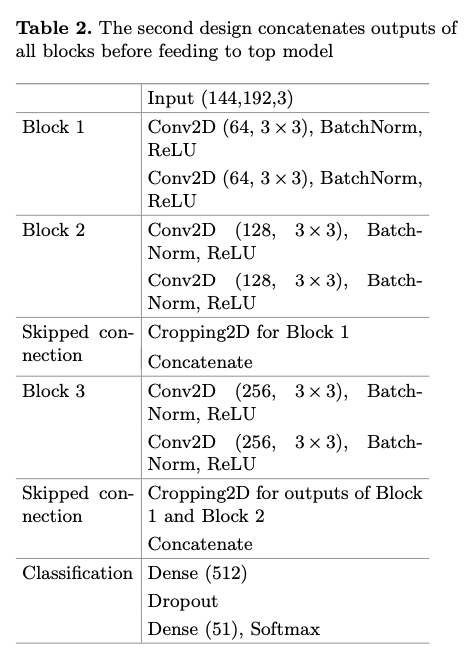
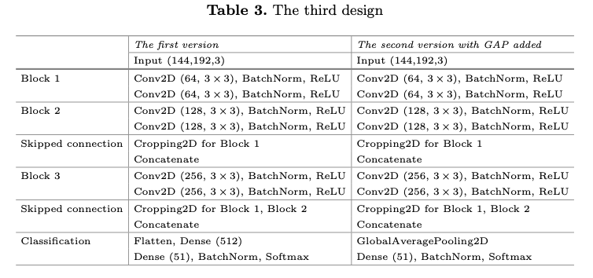
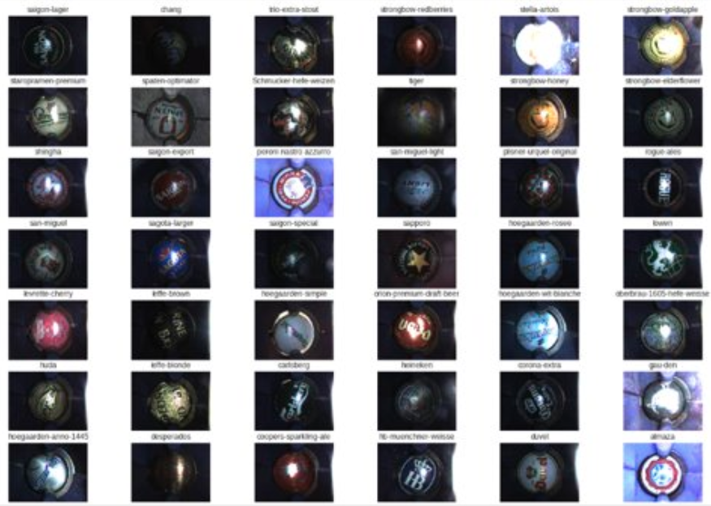
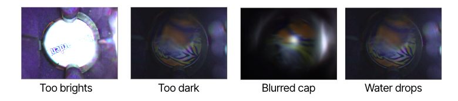
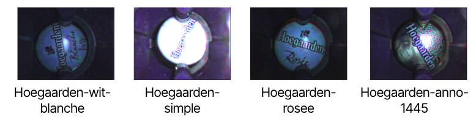
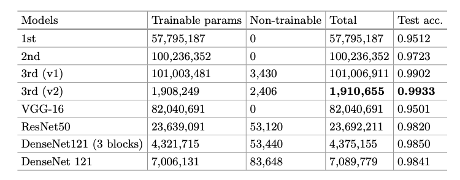
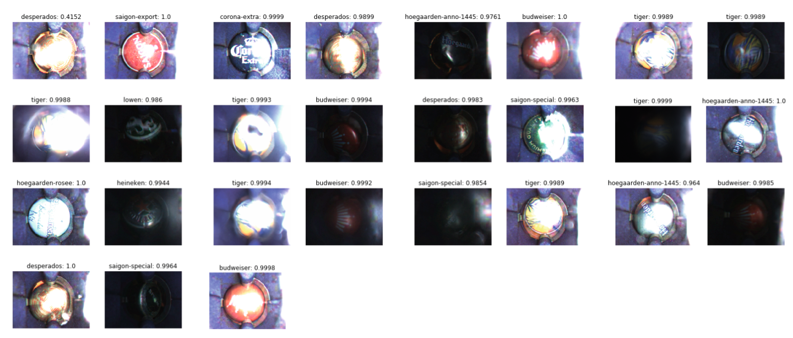
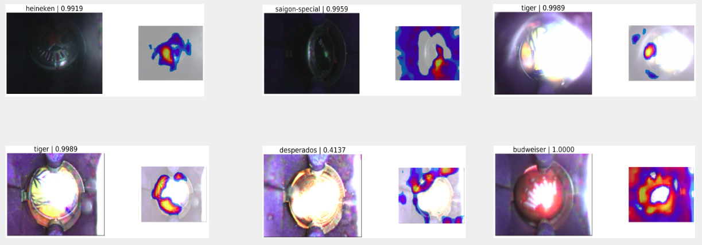

# Efficient CNN models for beer bottle cap classification problem

# Abstract
In this work, we present an efficient solution to the beer bot- tle cap classification problem. This problem arises in the Wecheer smart opener project. Although classification problem is common in Computer Vision, there is no dedicated work for beer bottle cap dataset. We com- bine state-of-the-art deep learning techniques to solve the problem. Our solution outperforms the well-known commercial system that is currently used by the Wecheer project. It is also more efficient than the famous architectures such as VGG, ResNet, and DenseNet for our purposes.

# 3 proposed CNN architecture designs

1-st desgin


2-nd desgin



3-rd design (optimal, SkippedVGG)



# About the dataset

## Overall
Nearly 8000 real bottle cap images are captured by our IoT Smart Bottle Openners. These are 51 beer brands / classes need to classifiy.



## Challenges

### Bad conditions



### Sub-brands with similar visuals



### Sub-brands with same patterns and are only different in colors


# Experimental results

## Training plot

SkippedVGG quickly converge without dealing with over-fitting


## Performance of SkippedVGG

We compare our 3 architectures with popular baseline models, i.e. VGG16, ResNet, and DenseNet by number of parameters and test accuracy as below




We further explore the precision, recall and f1, SkippedVGG proves it is robust to bottle cap classification despite being under hard condition of the dataset.


## Robust classification results

We pick some cases to show the effectiveness of SkippedVGG under many challenging conditions. A lot of images suffer the blur effect due to fast openning action. Additionally, some reflect the flash from the camera lacking most patterns, while others are under dark condition. However, SkippedVGG still give high prediction confidence.



## Class Activation Map visualization

To understand how SkippedVGG predict the result, we leverage Class Activation Map (CAM) to visualize the "attention" of model. When most of patterns are flushed out due to darkness or brightness, the model still correctly captures the regions with rich patterns.



# Citation
```
@inproceedings{tran2019-skippedvgg,
  title={Efficient cnn models for beer bottle cap classification problem},
  author={Tran, Quan M and Nguyen, Linh V and Huynh, Tai and Vo, Hai H and Pham, Vuong T},
  booktitle={International Conference on Future Data and Security Engineering},
  pages={713--721},
  year={2019},
  organization={Springer}
}
```