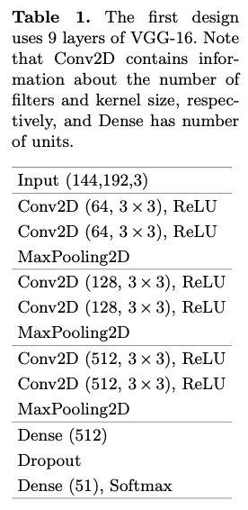
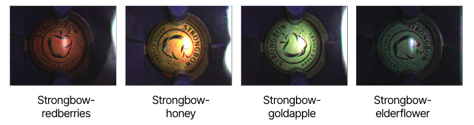
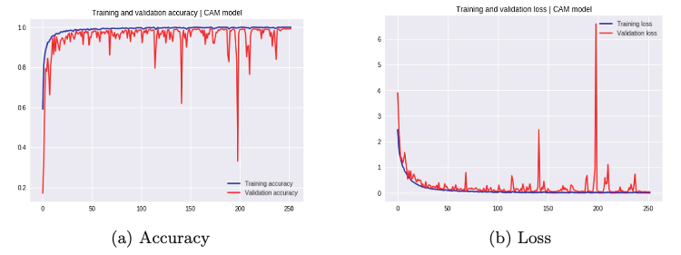
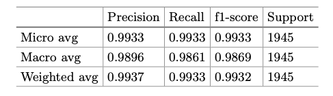

# Efficient CNN models for beer bottle cap classification problem

# Abstract
In this work, we present an efficient solution to the beer bot- tle cap classification problem. This problem arises in the Wecheer smart opener project. Although classification problem is common in Computer Vision, there is no dedicated work for beer bottle cap dataset. We com- bine state-of-the-art deep learning techniques to solve the problem. Our solution outperforms the well-known commercial system that is currently used by the Wecheer project. It is also more efficient than the famous architectures such as VGG, ResNet, and DenseNet for our purposes.

# 3 proposed CNN architecture designs

1-st desgin



2-nd desgin


3-rd design (optimal, SkippedVGG)


# About the dataset

## Overall
Nearly 8000 real bottle cap images are captured by our IoT Smart Bottle Openners. These are 51 beer brands / classes need to classifiy.


## Challenges

### Bad conditions


### Sub-brands with similar visuals


### Sub-brands with same patterns and are only different in colors




# Experimental results

## Training plot




## Performance of SkippedVGG



## Number of hyperparameters


## Robust classification results


## Class Activation Map visualization


# Citation
```
@inproceedings{tran2019-skippedvgg,
  title={Efficient cnn models for beer bottle cap classification problem},
  author={Tran, Quan M and Nguyen, Linh V and Huynh, Tai and Vo, Hai H and Pham, Vuong T},
  booktitle={International Conference on Future Data and Security Engineering},
  pages={713--721},
  year={2019},
  organization={Springer}
}
```